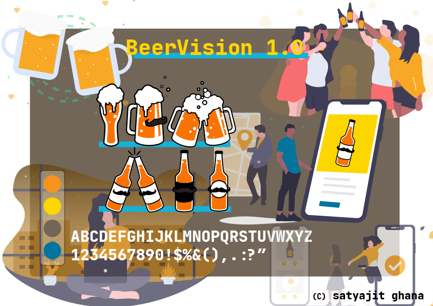

# Visual Elements of User Interface Design

## Week 01



Project Title

```
BeerVision 1.0
```

Write a short description of your project idea. The description should answer the following questions: What is it, Who is it for, and Where does it live?

```
An app to find the exact beer you need and of what quantity in your nearby location for sleep deprived working professionals working at late night.
```

Write a tagline for your project, using suitable language aligned with the intended audience.

```
get the beer you need to get your work going !
```

Describe the main activity or function of the app. What will the user be able to do from the app's home screen?

```
With our revolutionary beer tracking data, we can find the exact beer you are looking for as nearby as possible. The users will be able to pick the beer they need, with the required quantity, and the app will fire a query and get you the results as soon as possible. Once the results are fetched you can make an order or go to the location to pickup your order !
```
